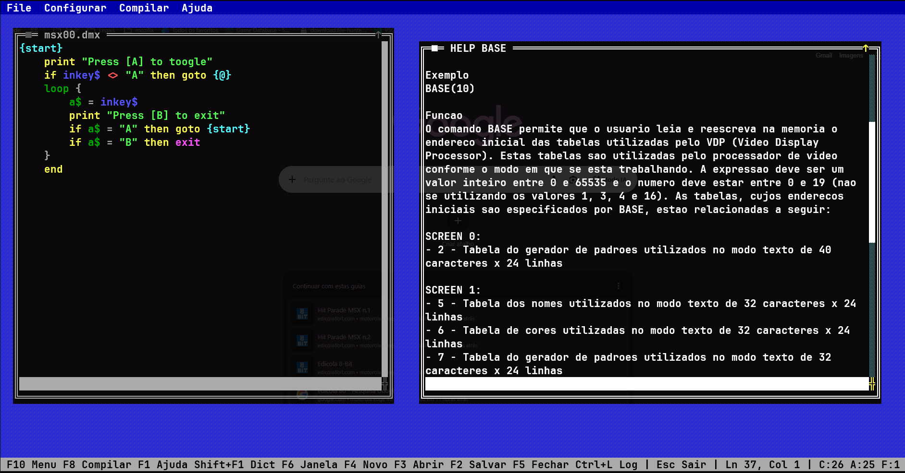

# msxIDE



**v0.1.1 — "MAMUTE.SYS"**

Um ambiente de desenvolvimento em modo texto (TUI) para MSX BASIC e Z80 Assembly, escrito em
FreeBASIC. Inspirado nas ferramentas clássicas de MS-DOS (EDIT, QuickBasic) e nos monitores/assemblers
interativos da era 8-bit do MSX.

📖 [MANUAL.md](MANUAL.md) — instalação, compilação, atalhos.
📐 [SPEC.md](SPEC.md) — arquitetura, decisões de projeto, o roadmap do Mamute Assembler.
📝 [CHANGELOG.md](CHANGELOG.md) — histórico de versões.

## O que já está implementado

- **Editor de texto em TUI**, multi-documento, janelas MDI (arrastar/redimensionar/maximizar/fechar),
  barras de rolagem, roda do mouse.
- **Compilação MSX BASIC / Basic Dignified**: gera `.amx`/`.bmx`, monta disco `.dsk` (boot MSX-DOS
  real) e lança o **openMSX** automaticamente.
- **Z80 Assembly via asMSX**: novo documento `.asm` com um "Hello ASM World" pronto; compilar+executar
  monta com o asMSX de verdade e oferece inserir o binário num programa BASIC aberto (`BLOAD` direto,
  loader `DATA`/`POKE`+`DEFUSR`, ou `.inc` reaproveitável).
- **Sistema de projetos** (`.msxproj`): um arquivo SQLite portátil que empacota fontes, binários e
  configuração — abre extraindo pra uma pasta de trabalho, salva reimportando tudo de volta.
- **Ajuda integrada**: Basic Dignified, Dignified, BaToken, asMSX, dicionário MSX BASIC completo
  (verbete contextual com `Shift+F1`), e um guia do próprio editor.
- **Menu Referência**: dez documentos técnicos MSX portados pra dentro do IDE — The MSX Red Book, MSX2
  Technical Handbook, manuais MSX-DOS2/Z80/R800/Turbo-Basic/FM-PAC, BIOS Chamadas/Hardware/
  Documentação, openMSX, Nestor Basic, SEE Tracker, MSXBAS2ROM.
- **Mamute Assembler** (início): configurador de memória simulada (slots, sub-slots, páginas, RAM/ROM)
  e um terminal `MON>` estilo ZX-81 — réplica em andamento de um monitor/assembler Z80 interativo.
  Roadmap completo em [SPEC.md](SPEC.md#2-módulo-mamute-assembler).

## Ferramentas usadas neste projeto

- **[Claude Code](https://claude.com/claude-code)** (Anthropic) — pair programming, pesquisa e
  implementação assistida por IA.
- **FreeBASIC** — linguagem/compilador do msxIDE.
- **[newt-freebasic](https://github.com/paul-swan/newt-freebasic)** — biblioteca de terminal usada pelo
  backend de console alternativo (`--Backend newt`).
- **Windows 11** + **Windows Console API** — backend nativo padrão.
- **PowerShell** — build, versionamento e testes (`build.ps1`, `tests/`).
- **SQLite** — persistência de configurações, projetos e métricas.
- **Visual Studio Code** + **GitHub** — desenvolvimento e versionamento.

## Agradecimentos

O msxIDE se apoia em ferramentas e documentação de terceiros — nossa gratidão a quem as criou:

- **[Fred Rique (farique1)](https://github.com/farique1)**, autor da
  **[Basic Dignified Suite](https://github.com/farique1/basic-dignified)**, o compilador/tokenizer de
  MSX BASIC usado neste projeto.
- **Eduardo "pitpan" A. Robsy Petrus**, criador original do **[asMSX](https://www.msx.org/wiki/asMSX)**
  (baseado na liberação GPLv3 de Lucas "cjv99", hoje mantido pelo time asMSX), o cross-assembler Z80
  usado para Z80 Assembly.
- **Cibertron Software**, criadores do **Mega Assembler** (1987), o monitor/assembler/desmontador
  original em cartucho que inspira metade do Mamute Assembler.
- **Romi**, autor original do **SUPER-X** (1994), o monitor/debugger avançado que inspira a outra
  metade do Mamute Assembler — e **NYYRIKKI**, autor da versão estendida (2011), com tradução do
  japonês por **JP Grobler**.

## Módulos do msxIDE (nomes pré-históricos)

Tradição herdada do projeto-irmão `paleobasic/` (onde o próprio Mamute Assembler já nasceu com esse
apelido): cada módulo do msxIDE tem um nome de bicho pré-histórico. Tabela completa e o porquê de cada
um em [SPEC.md](SPEC.md#1-visão-geral-da-arquitetura).

| Arquivo | Apelido |
|---|---|
| `main.bas` | Trilobita |
| `editor.bas` | Tiranossauro |
| `compiler.bas` | Pteranodonte |
| `db.bas` | Arqueloni |
| `project.bas` | Amonite |
| `console.bas` | Ictiossauro |
| `console_win.bas` | Anquilossauro |
| `console_newt.bas` | Salamandra |

## Início rápido

```powershell
.\build.ps1 --Basic C:\dos\freebasic --Compiler fbc64.exe --Backend win
.\msxide.exe
```

Veja [MANUAL.md](MANUAL.md) para instruções completas de instalação, compilação e uso.

## Licença

GPLv3 — ver [LICENSE](LICENSE).
